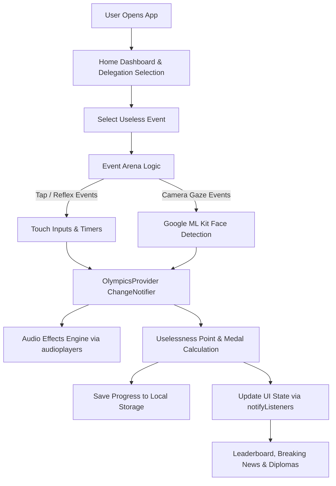

# WhyNot! – The Useless Olympics 🎯

### Basic Details
**Team Name:** Strawberry
**Team Members:**
- **Member 2:** Fasna Jasmin N V - Government Engineering College Kozhikode
- **Member 3:** Ayisha Renna -  Government Engineering College Kozhikode

---

### Project Description
**WhyNot!** transforms daily digital procrastination and unproductive habits into an Olympic-level tournament. Compete across absurd mini-games like rapid phone unlocking, pointless webpage refreshes, and face-tracked staring marathons to win gold medals and earn official diplomas honoring your supreme idleness.

---

### The Problem (that doesn't exist)
In modern society, people spend hours unconsciously refreshing static webpages, repeatedly opening empty refrigerators, and locking and unlocking phones with zero purpose—yet receive absolutely zero recognition, medals, or national glory for this dedicated waste of human potential.

---

### The Solution (that nobody asked for)
An interactive mobile tournament app that formally tracks your idle habits, calculates your cumulative "Overall Uselessness" percentage, allows you to represent proud squads like the *Couch Potatoes Republic* or *Kerala Athlete Alliance*, and broadcasts breaking news flashes celebrating your record-shattering sloth.

---

### Technical Details

#### Technologies / Components Used
**For Software:**
- **Languages Used:** Dart
- **Frameworks Used:** Flutter
- **Libraries Used:** 
  - `provider` (reactive state management via `ChangeNotifier`)
  - `audioplayers` (background music & interactive sound effects)
  - `google_mlkit_face_detection` (biometric gaze & blink tracking)
- **Tools Used:** Antigravity IDE, Git, GitHub, Android Studio build toolchain

---

### Implementation

#### For Software:

**Installation:**
```bash
git clone [https://github.com/fassna/WhyNot-.git](https://github.com/fassna/WhyNot-.git)
cd WhyNot-
flutter pub get
```
Run
bash 
flutter run

Project Documentation
For Software:

Screenshots (Add at least 3)


#### Diagrams



Project Demo
Video
https://drive.google.com/drive/folders/10_wK2JMkDqsfPMR_z5fpL0zdrJVYaJ8P

Additional Demos
https://drive.google.com/drive/folders/10_wK2JMkDqsfPMR_z5fpL0zdrJVYaJ8P

Team Contributions
Fasna Jasmin:full-stack development
Ayisha Renna: UI design
Made with ❤️ at TinkerHub Useless Projects

